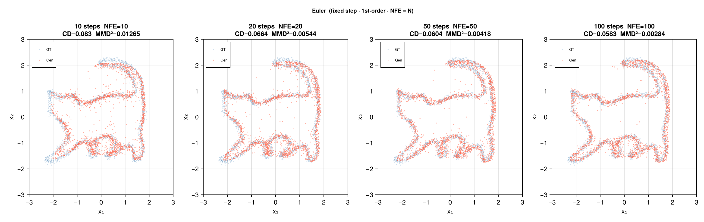
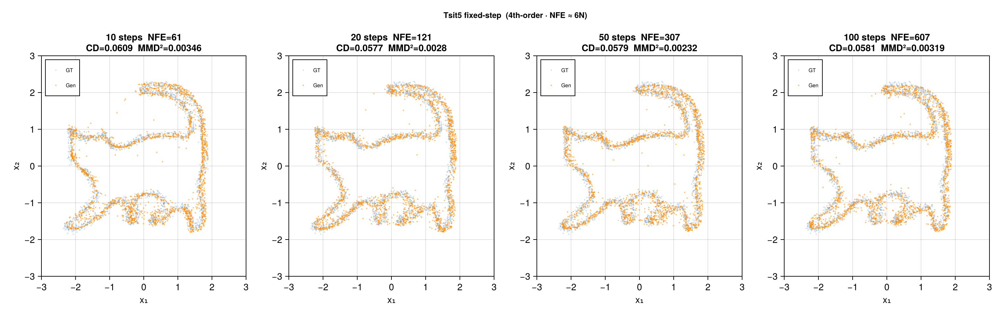

# julia-diffusion

Generative diffusion models implemented from scratch in Julia.
All scripts support CUDA GPU acceleration and fall back to CPU automatically.

> Blog: https://diffusion.kowyo.workers.dev/posts/ddpms-to-continus-time-diffusions/


## Quick Start

### Dependencies

```julia
using Pkg
Pkg.add([
    "Flux", "Zygote", "CUDA", "cuDNN",
    "OrdinaryDiffEq",
    "CairoMakie", "Statistics", "Printf", "Random"
])
```

For the MNIST script, additional packages are installed automatically on first run:
`MLDatasets`, `ProgressMeter`, `JSON`, `BSON`, `Plots`, `GR`.

### Run

```bash
# DDPM (Two Moons)
julia naive-diff.jl

# VP-SDE score diffusion (Cat)
julia sde-diff/sde.jl

# Brownian Bridge Flow Matching (Cat)
julia sde-diff/brown-sde.jl

# Rectified Flow + sampler benchmark (Cat)
julia flow-diff/rectified-flow.jl

# Conditional Rectified Flow + CFG (MNIST, requires CUDA)
julia flow-diff/train_mnist_cfg_rectifiedflow_cuda.jl
```

Output images are saved to `output/` at the project root.
MNIST outputs (samples, model checkpoints, training history) are saved to
`outputs/MNIST_CFG_RF_CUDA_<timestamp>/`.


## Project Structure

```
julia-diffusion/
├── naive-diff.jl                         # DDPM (discrete VP-diffusion, Two Moons)
├── sde-diff/
│   ├── sde.jl                            # VP-SDE (continuous score diffusion, Cat)
│   └── brown-sde.jl                      # Brownian Bridge Flow Matching (Cat)
├── flow-diff/
│   ├── rectified-flow.jl                 # Rectified Flow + sampler benchmark (Cat)
│   └── train_mnist_cfg_rectifiedflow.jl  # Conditional Rectified Flow + CFG (MNIST)
└── output/
    ├── naive-out/
    ├── sde-out/
    └── flow-out/
```


## Models

### 1. DDPM — `naive-diff.jl`

Discrete-time denoising diffusion probabilistic model (Ho et al. 2020), trained on a 2D Two Moons dataset.

- **Forward process**: linear β schedule from β₁ = 1e-4 to β_T = 0.02 over T = 1000 steps.
  Each step corrupts data according to `q(x_t|x_0) = N(√ᾱ_t · x_0, (1−ᾱ_t)·I)`, where ᾱ_t = ∏αₛ.
- **Model**: time-conditioned MLP. Input is `(x_t, t/T)` concatenated; output predicts noise ε.
  Architecture: 4-layer Dense with GELU activations, hidden size 128.
- **Objective**: MSE noise prediction — `L = E‖ε_θ(x_t, t) − ε‖²`
- **Reverse process**: Euler-Maruyama, 1000 denoising steps:
  `x_{t-1} = (x_t − β_t/√(1−ᾱ_t) · ε_θ) / √α_t + √β_t · z`


### 2. VP-SDE — `sde-diff/sde.jl`

Variance Preserving SDE, continuous-time score-based generative model (Song et al. 2021), trained on a 2D Cat outline dataset.

- **Forward SDE**: `dx = −β(t)/2 · x dt + √β(t) dW`,  t ∈ [0, 1],  β(t) = β_min + t·(β_max − β_min)
- **Perturbation kernel**:
  `p(x_t|x_0) = N(α(t)·x_0, σ²(t)·I)`,
  where `α(t) = exp(−½∫₀ᵗ β(s) ds)` and `σ(t) = √(1 − α²(t))`
- **Score function**: `∇_x log p_t(x_t|x_0) = −ε / σ(t)`
- **Model**: MLP ε-predictor with sinusoidal time embedding (T_EMBED_DIM = 8).
  Input is `(x_t ‖ t_embed)`, output predicts ε. Architecture: 4-layer Dense, hidden size 256.
- **Objective**: MSE noise prediction — `L = E‖ε_θ(x_t, t) − ε‖²`
- **Reverse SDE** (Euler-Maruyama, t: 1 → 0):
  `Δx = [β/2·x + β·s_θ]·Δt + √(β·Δt)·z`,  z ~ N(0, I)


### 3. Brownian Bridge Flow Matching — `sde-diff/brown-sde.jl`

Stochastic interpolation using a Brownian bridge as the transport path (Somnath et al. 2023),
mapping X₁ ~ U([2, 3]²) (noise, disjoint from data) to X₀ (Cat outline).

- **Time axis**: t = 1 is pure noise, t = 0 is clean data.
- **Forward bridge** (training):
  `x_t = (1−t)·x_0 + t·x_1 + σ·√(t(1−t))·ε`,  ε ~ N(0, I),  σ = 0.387
  Variance peaks at t = 0.5 and vanishes at both endpoints.
- **Model**: predicts the data endpoint x̂_0 = model(t, x_t) directly.
  Architecture: residual MLP with separate time and state branches fused by addition.
  Output uses an external residual: `x̂_0 = x_t + decode(h)·(t + 0.05)`,
  which vanishes smoothly as t → 0, anchoring predictions to the data manifold.
- **Objective**: weighted MSE — `L = E[1/(t + 0.05)² · ‖x̂_0 − x_0‖²]`
  The weight `1/(t + 0.05)²` upweights steps near t = 0 (data end), improving fine-grained reconstruction.
- **Exact bridge step** (inference, t: 1 → 0):
  Derived from the conditional distribution B_{t2} | B_{t1} of a Brownian bridge:
  `x_{t2} = (t1−t2)/t1 · x̂_0 + t2/t1 · x_{t1} + σ·√(t2(t1−t2)/t1)·ε`
  Noise magnitude shrinks as t2 → 0, locking onto the predicted data point deterministically.


### 4. Rectified Flow — `flow-diff/rectified-flow.jl`

Learns a straight ODE transport from noise to data (Liu et al. 2022).
Because the path is a linear interpolation, the velocity field is constant and requires fewer NFE at inference.

- **Time axis**: t = 1 is noise, t = 0 is data.
- **Interpolation**: `x_t = t·x_noise + (1−t)·x_data`
- **Target velocity**: `v* = x_noise − x_data`  (constant along the straight path)
- **Objective**: `L = E‖v_θ(x_t, t) − v*‖²`
- **Sampling**: ODE `dx/dt = v_θ(x, t)`, integrated from t = 1 → 0.
- **Model**: residual MLP with sinusoidal time embedding (T_EMBED_DIM = 32, hidden = 256, 3 residual blocks).
  Time and state branches are fused by addition before passing through residual layers.
- **Source**: U([2, 3]²), disjoint from cat data (≈ [−2, 2]²)
- **Datasets**: `make_cat` / `make_rings` / `make_moons` / `make_checkerboard` — set via `DATA_FN`
- **Metrics**: Chamfer Distance (CD ↓) and MMD² with RBF kernel (σ = 0.5)


#### Sampler Benchmark

Four ODE solvers are benchmarked at 10 / 20 / 50 / 100 steps on the Cat dataset.
All samplers use the same trained model; only the integrator changes.

| Sampler | Step type | Order | NFE / step | Notes |
|---|---|---|---|---|
| Euler | fixed | 1st | 1 | baseline, highest NFE for same quality |
| Heun | fixed | 2nd | 2 | predictor-corrector; best cost-quality tradeoff |
| Tsit5 fixed | fixed (adaptive=false) | ~4th | ~6 | high-order reference |
| Tsit5 adaptive | adaptive | ~5th | tol-dependent | error-controlled; fewest NFE at loose tolerance |

| Sampler | Result |
|---|---|
| Euler |  |
| Heun |  |
| Tsit5 fixed |  |
| Tsit5 adaptive |  |


### 5. Conditional Rectified Flow + CFG — `train_mnist_cfg_rectifiedflow_cuda.jl`

Class-conditional generation on MNIST using Rectified Flow with Classifier-Free Guidance (Ho & Salimans 2022).

- **Conditioning**: class label encoded as one-hot spatial planes (28×28×11) concatenated along the channel dim.
  Class 0 = unconditional token; classes 1–10 = digits 0–9.
  Total input channels: 1 (image) + 1 (time plane) + 11 (class planes) = 13.
- **CFG training**: 20% of labels are randomly dropped and replaced by the unconditional token,
  training the model to handle both conditional and unconditional inputs within a single network.
- **CFG sampling**: `v = v_uncond + scale · (v_cond − v_uncond)`,  default scale = 2.0.
  Higher scale sharpens class alignment at the cost of sample diversity.
- **Model**: lightweight CNN — four Conv 3×3 layers with GELU, hidden channels = 64.
  Accepts the time-and-class-augmented 28×28×13 tensor, outputs a 28×28×1 velocity field.
- **ODE**: Euler integration, t: 1 → 0, 50 steps at inference.
- **Training**: Adam, lr = 2e-4, batch size = 128. Checkpoint + sample grid saved every 2000 steps.
- **Output**: per-step sample grids (10 digits × 8 samples) saved as PNG; model checkpointed as BSON.


## Model Comparison

| Model | Path type | Noise source | Inference | Dataset |
|---|---|---|---|---|
| DDPM | discrete SDE | N(0, I) | 1000 Euler-Maruyama steps | Two Moons |
| VP-SDE | continuous SDE | N(0, I) | Euler-Maruyama, t: 1→0 | Cat outline |
| Brownian Bridge | stochastic bridge | U([2,3]²) | exact bridge steps, t: 1→0 | Cat outline |
| Rectified Flow | deterministic ODE | U([2,3]²) | Euler / Heun / Tsit5, t: 1→0 | Cat / rings / moons / checkerboard |
| CFG Rectified Flow | deterministic ODE (conditional) | N(0, I) | Euler, t: 1→0 | MNIST |
